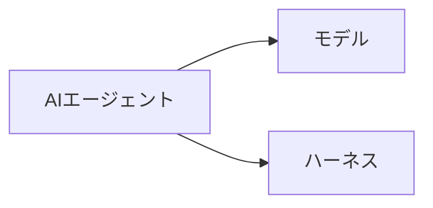

# agent-article

URL を受け取り、記事を Markdown と HTML に変換し、**git commit と git push まで PO/ユーザー承認なしで一括実行する。** 日本語以外の記事は自動翻訳する。対象は常に Markdown と HTML の両方。

## 実行手順

1. URL からサイトを判定
2. 適切なスクリプトを実行
3. **画像処理**: 通常記事・x.com は画像説明を生成し、Speaker Deck はスライドを意味変換する（後述）
4. **言語判定・翻訳**: 記事が日本語以外の場合、日本語に翻訳する（後述の「翻訳ルール」を参照）
5. 画像処理・翻訳・意味変換後の Markdown から HTML を再生成する（後述）
6. Markdown と HTML の出力ファイルを確認（保存禁止条件に該当しないこと。確認はエージェント自身が行い、ユーザー承認は待たない）
7. git add → commit → **push まで自動実行**（Markdown と HTML の両方を対象にする）

取得〜commit〜push は一連の処理として途中停止せず完了する。PO 承認、ユーザー確認、push 可否の質問はしない。

## 保存対象の制限

以下は保存・commit しない。該当する場合はユーザーに報告して停止する:

- 非公開・限定公開の x.com 投稿（フォロワー限定、鍵アカウント等）
- 非公開・パスワード保護の Speaker Deck
- 認証が必要な社内 URL・イントラネット URL
- 取得内容にローカルパス（`file://`, `file+.vscode-resource` 等）が含まれる場合は除去してから保存

## フロー判定

| URL パターン | スクリプト |
|---|---|
| `x.com/*` または `twitter.com/*` | `extract_xcom.py` |
| `speakerdeck.com/*` | `extract_speakerdeck.py` |
| 上記以外 | `extract_article.py` |

## フローA: 認証なしサイト

```bash
python3 .cursor/skills/agent-article/extract_article.py "<URL>"
```

スクリプトは以下を stdout に JSON で出力する:

```json
{
  "file_path": "agent-articles/md/タイトル.md",
  "html_file_path": "agent-articles/html/タイトル.html",
  "title": "記事タイトル",
  "images": [
    {"index": 0, "alt": "alt text", "original_url": "https://...", "local_path": "/tmp/article-images/abc123.jpg"}
  ]
}
```

`images` が空でない場合、エージェントは「画像説明の生成」ステップを実行する（後述）。

## フローB: x.com（認証あり）

```bash
python3 .cursor/skills/agent-article/extract_xcom.py "<URL>"
```

- デフォルトブラウザ: **Brave**（固定、引数不要）
- 前提: ユーザーが Brave で x.com にログイン済み
- stdout 出力形式はフローA と同一（`images` 配列を含む）

## フローC: Speaker Deck

```bash
python3 .cursor/skills/agent-article/extract_speakerdeck.py "<URL>"
```

- 対象: 公開トーク `https://speakerdeck.com/{user}/{slug}`
- 非公開・パスワード保護・埋め込み専用ページは保存しない（エラー報告して停止）
- JSON-LD のスライド本文（Transcript）と各スライド画像を取得する
- stdout の `images` 配列に全スライドを含む。各要素には補助情報として `slide_number` と `transcript` も含む
- `content_type` は `slides`

### Speaker Deck の意味変換（必須）

Speaker Deck は通常の「画像説明の生成」を適用しない。スライド内の文字列をそのまま転記せず、画像を主資料、Transcript を OCR 補助資料として内容を理解し、**単独で読んで意味が通る Markdown** に再構成する。

スクリプトは各ページを次のプレースホルダーとして出力する:

```markdown
## スライド 1 / 35

<!-- INTERPRET_SLIDE_0 -->
```

各 `images` 要素について以下を実行する:

1. `local_path` のスライド画像を Read ツールで読む
2. `transcript` と画像を照合する。文字の並び順・グルーピング・矢印・包含関係・強調・軸・凡例は画像を正とする
3. スライドの主張と情報構造を理解し、`<!-- INTERPRET_SLIDE_N -->` を意味の通る Markdown に置換する
4. 全ページ処理後、OCR 由来の分断文字、ページ番号、元画像リンク、プレースホルダーが残っていないことを確認する

**変換ルール:**

- スライドのタイトルは `###` 見出しにする
- 説明文は主語と述語のある自然な文章にする
- 並列項目・手順・分類は箇条書きまたは番号付きリストにする
- 比較表・マトリクスは Markdown 表にする
- 矢印、循環、包含、階層など、図の関係性が主題なら Mermaid または入れ子リストで表現する
- グラフは軸・系列・主要数値・傾向・結論を文章または表にする
- コードは構文を復元してコードブロックにする
- 写真は主張の理解に必要な意味だけを文章化し、配色や装飾など本質でない外観説明は省く
- Transcript は誤った読み順や文字間スペースを含むため、そのまま貼り付けない
- 画像と Transcript に存在しない情報を推測で補わない
- 同じ内容を「本文」と「図の説明」に重複させない。意味変換した本文だけを残す
- 原資料の主張・数値・固有名詞は保持する。要約で重要情報を落とさない

**禁止される出力例:**

```markdown
H AR N ESS ENG IN EERIN G
AGENT
=
MODEL
+
HARNESS
> **[図]** 箱と矢印が配置されたスライド。
```

**期待する出力例:**

````markdown
### ハーネスエンジニアリングとは

AIエージェントは、推論を担うモデルと、その外側で動作を支えるハーネスから構成される。



ハーネスには指示ファイル、ツール、検証、ガードレール、実行ループなどが含まれる。
````

## Git 操作

スクリプト実行 → 画像説明またはスライド意味変換 → HTML 再生成後、以下を**承認待ちなしで一括実行**する。Markdown だけを add/commit/push してはならない。HTML は必須対象である。

```bash
git add -- "agent-articles/md/{filename}.md" "agent-articles/html/{filename}.html"
git commit -m "docs(articles): add {タイトル要約}"
git push
```

- `file_path` と `html_file_path` の両方を必ず `git add` する
- HTML 再生成後のファイルが存在することを commit 前に確認する。無い場合は `render_html.py` を再実行してから add する
- このスキル起動時の push はユーザー明示依頼とみなす。PO/ユーザーへの push 可否確認はしない
- 翻訳や意味変換でファイル名が変わった場合は、旧ファイル名の残骸を残さず、最終の `.md` と `.html` のペアだけを対象にする

### コミットメッセージ規則

- 形式: `docs(articles): add {タイトルを50文字以内に要約}`
- 記事タイトルから、何の記事か分かる簡潔なメッセージを生成
- 翻訳記事は日本語タイトルに `（{言語名}から翻訳）` を付加（詳細は翻訳ルールを参照）
- 日本語記事はそのまま日本語で要約
- 例: `docs(articles): add React Server Components解説`
- 例: `docs(articles): add LLMエージェントの設計パターン（英語から翻訳）`

## 出力フォーマット仕様

保存先:

- Markdown: `agent-articles/md/{sanitized_title}.md`
- HTML: `agent-articles/html/{sanitized_title}.html`

ファイル名のサニタイズ: `/\:*?"<>|` を除去、空白を `-` に変換、100文字以内に切り詰め。

### HTML の再生成

各抽出スクリプトは初期 Markdown と HTML を同時に作成する。画像説明の挿入、Speaker Deck の意味変換、翻訳などで Markdown を変更した場合は、最終版を反映するため次を実行する:

```bash
python3 .cursor/skills/agent-article/render_html.py "agent-articles/md/{filename}.md"
```

HTML は Markdown の frontmatter を `<meta>` 要素、本文を HTML5 要素に変換した単独で閲覧可能な文書として生成される。参照用のリッチUIと同等のダークテーマ、カード型レイアウト、読みやすい日本語タイポグラフィ、見出し・引用・コード・表の装飾を採用し、目次、読了進捗バー、セクション追従、コードコピー、レスポンシブ表示、印刷表示を提供する。HTML 側にプレースホルダー、原文画像リンク、未翻訳の本文を残さない。

### Markdown 構造

```markdown
---
title: "記事タイトル"
source_url: "https://example.com/article"
author: "著者名"
published_at: "YYYY-MM-DD"
retrieved_at: "YYYY-MM-DDTHH:MM:SS+09:00"
site: "example.com"
content_type: "article"
---

# 記事タイトル

{本文}
```

### frontmatter フィールド

| フィールド | 必須 | 説明 |
|---|---|---|
| title | Yes | 記事タイトル（翻訳時は日本語訳） |
| source_url | Yes | 元URL |
| author | No | 著者名（取得できない場合は省略） |
| published_at | No | 公開日（取得できない場合は省略） |
| retrieved_at | Yes | 取得日時（ISO 8601） |
| site | Yes | ドメイン名 |
| content_type | Yes | `article` / `tweet` / `thread` / `slides` |
| original_language | No | 原文の言語（翻訳した場合のみ。例: `en`, `zh`, `ko`）|

### 通常記事・x.com の本文変換ルール

- 見出し(h1-h6)、段落、リスト、引用、コードブロックをそのまま Markdown に変換
- **画像**: 画像リンク (``) は出力しない。代わりにエージェントが画像を読み取り、内容を自然言語で説明するテキストに置換する（後述の「画像説明の生成」を参照）
- リンクは `[text](url)` 形式で保持（`file://` / `file+.vscode-resource` は除去）
- 広告・ナビゲーション・フッターは除去
- 内容自体は改変しない

### 画像説明の生成（エージェント処理）

スクリプトは画像を `<!-- DESCRIBE_IMAGE_N -->` プレースホルダーに置換し、画像ファイルをローカルにダウンロードする。エージェントが画像を直接読み取り、内容を自然言語で説明する。

**スクリプト出力の `images` 配列が空でない場合、以下を実行する:**

1. `images` 配列の各要素について:
   a. `local_path` のファイルを **Read ツールで読み取る**（画像として認識される）
   b. 画像の内容を見て、**何が描かれているか・何を伝えているかを自然言語で簡潔に説明する**文を書く
   c. Markdown ファイル内の `<!-- DESCRIBE_IMAGE_N -->` を `> **[図]** {説明文}` に置換する
2. `local_path` が `null`（ダウンロード失敗）の場合:
   - `alt` テキストがあれば `> **[図]** {alt}` に置換
   - なければプレースホルダーを除去
3. 全画像の処理後、一時ファイルを削除する: `rm -rf /tmp/article-images/`

**説明文の書き方:**
- 画像の内容を客観的に、1〜3文で説明する
- グラフ・図表の場合は、軸・ラベル・主要な数値・傾向を含める
- スクリーンショットの場合は、表示されているUI要素・テキストの要点を記述する
- 写真の場合は、被写体・構図・文脈を記述する
- コードの画像の場合は、コード内容をそのままテキストとして書き起こす

**出力フォーマット:**

```markdown
> **[図]** 2024年1月〜12月の月次売上推移を示す折れ線グラフ。1月の100万円から右肩上がりで推移し、12月に400万円に達している。
```

## 翻訳ルール

記事の言語が日本語以外の場合、本文を日本語に翻訳してから保存する。

**判定タイミング:** 画像説明の生成後、git commit 前に実行する。

**翻訳対象:**
- タイトル（`title` および `# 見出し`）
- 本文テキスト全体

**翻訳しないもの:**
- コードブロック内のコード
- URL
- 固有名詞（人名・製品名・企業名など。ただし定訳がある場合はそれを使用）
- frontmatter の `source_url`, `author`, `site` 等のメタデータ値

**翻訳の方針:**
- 技術記事として自然な日本語にする。直訳より意訳を優先
- 原文の構造（見出し階層、リスト、引用など）はそのまま保持する
- 専門用語は一般的なカタカナ表記または定訳を使用する（例: deployment → デプロイ、container → コンテナ）
- 翻訳であることを示すため、frontmatter に `original_language` フィールドを追加する（ISO 639-1 コード）

**ファイル名:**
- 翻訳後の日本語タイトルでサニタイズしてファイル名とする

**コミットメッセージ:**
- 翻訳記事の場合: `docs(articles): add {日本語タイトル要約}（{原文言語}から翻訳）`
- 例: `docs(articles): add LLMエージェントの設計パターン（英語から翻訳）`

## 設定

| 項目 | 値 |
|---|---|
| x.com 用ブラウザ | Brave（固定） |
| Markdown 出力先 | `agent-articles/md/` |
| HTML 出力先 | `agent-articles/html/` |
| Git 対象 | Markdown と HTML の両方 |
| Git 完了条件 | commit 後に `git push` まで実行（承認不要） |
| 画像一時保存先 | `/tmp/article-images/` |
| macOS 依存 | あり（Keychain による Cookie 復号） |

## 制約

- **Cookie 値の直接操作禁止**: AI は Cookie 値を読み取り・ログ出力しない
- **承認待ち禁止**: このスキルでは取得〜commit〜push を一括実行する。PO/ユーザー承認を待たない
- **HTML 必須**: commit/push 対象は Markdown と HTML の両方。Markdown のみの登録は禁止
- **内容改変禁止**: 通常記事・x.com は要約・編集せず忠実に変換する（ローカルパスリンクの除去および日本語以外の記事の翻訳を除く）。Speaker Deck は情報を落とさず、図と断片文字を意味の通る Markdown 構造へ再構成する
- **エラー時のみ停止**: スクリプトが非ゼロ終了した場合、または保存禁止条件に該当した場合のみユーザーに報告する

## エラーハンドリング

| エラー | 対応 |
|---|---|
| ネットワークエラー | エラーメッセージを報告して停止 |
| x.com 認証失敗 | 「Brave で x.com にログインし直してください」と報告 |
| ページ内容取得不可 | エラー内容を報告して停止 |
| Speaker Deck 非公開・取得不可 | エラー内容を報告して停止 |
| git push 失敗 | エラー内容を報告（ファイルは保存済み） |
