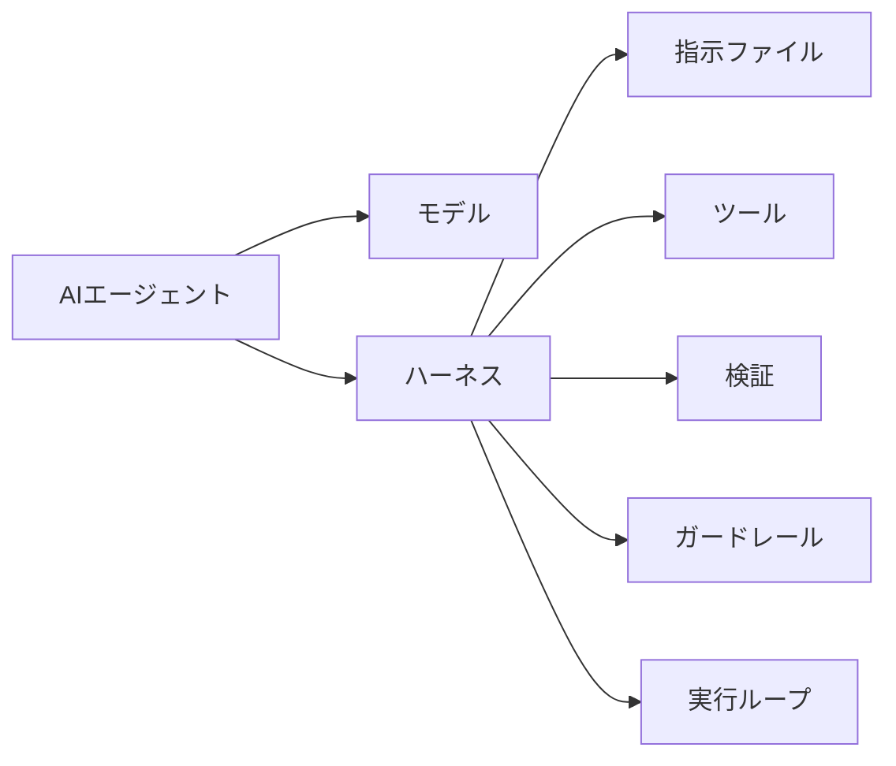
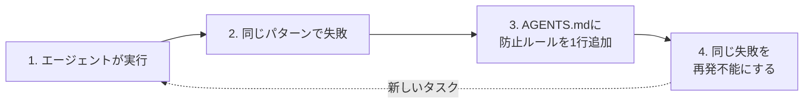
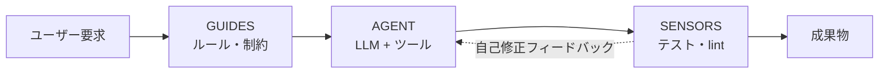
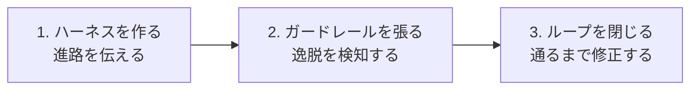
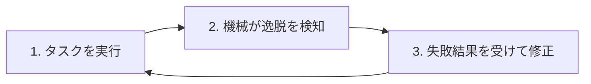
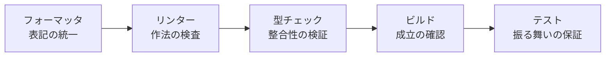
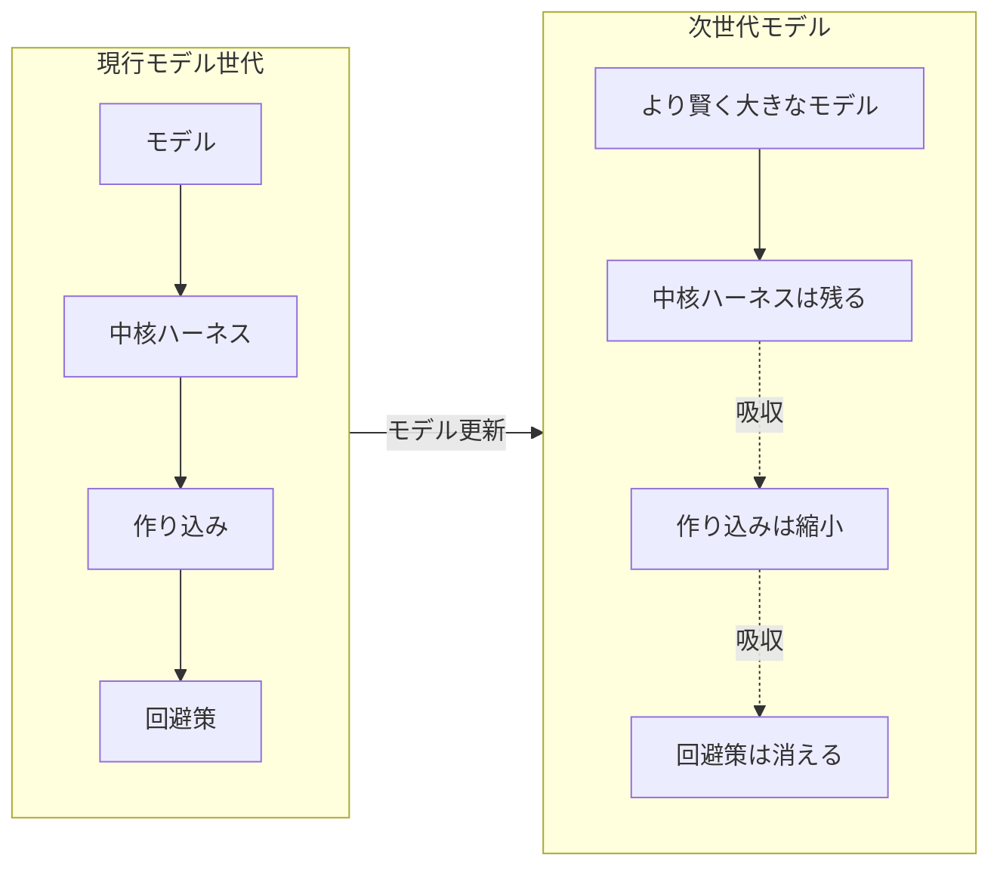

# ハーネス設計入門 〜プロンプト、コンテキストの次〜

AirCle＠AIコミュニティ開催の「ハーネス設計入門」で使用されたスライド資料。全体は、ハーネスエンジニアリングの定義が収束していく過程と、AIエージェントを自走させるための実践的な設計方法の2部で構成される。

## スライド 1 / 35

### AIエージェント時代のハーネス設計入門

本資料の目的は、AIエージェントが失敗を自ら検知・修正し、タスクを最後まで完走できる環境の設計方法を持ち帰ることにある。

- **第1部：系譜** — ハーネスエンジニアリングの定義の揺れと収束
- **第2部：実践** — 馬具・柵・ループという比喩を使った自走環境の設計

登壇者は、株式会社キー・プランニング代表取締役の木下雄一朗（Kinopee）。

## スライド 2 / 35

### 登壇者プロフィール

木下雄一朗（Kinopee）は、AIとソフトウェア開発の現場に、情報を発信する側と実際に利用する側の両方から関わっている。

- **所属**：株式会社キー・プランニング 代表取締役
- **著書**：
  - 『AIを開発チームに採用する技術』
  - 『AIエディタCursor完全ガイド』ほか
- **連載**：Software Design「プログラミング×AIの最前線」
- **活動**：
  - Devin Ambassador
  - Cursor Ambassador Regional Leader（East Asia）
- **X**：https://x.com/kinopee_ai

## スライド 3 / 35

### 第1部：ハーネスエンジニアリングの系譜

第1部では、ハーネスエンジニアリングをめぐる考え方を5つの流派に整理し、定義の違いを現場の実装と結び付けて読み解く。その後、2026年に語彙が収束・制度化され、効果が実証されていく過程を扱う。

## スライド 4 / 35

### ハーネスエンジニアリングとは

ハーネスエンジニアリングとは、エージェントが失敗するたびに、同じ失敗が繰り返されないよう「モデルの外側」にある環境を改善する営みである。



モデルは推論を担当する。それ以外の指示、ツール、検証、ガードレール、ループなどがハーネスに当たる。焦点は、モデル自体の賢さではなく、モデルを取り巻く環境を工学することにある。

この考え方は、次の順で発展した。

1. **2022年〜：プロンプトエンジニアリング**
2. **2024年〜：コンテキストエンジニアリング**
3. **2026年〜：ハーネスエンジニアリング**

資料では、2026年2月5日にMitchell Hashimotoが「失敗したら、二度と起きないよう環境を工学せよ」と命名し、同月11日にOpenAIが3人・100万行・95% AI生成という実践を公表したことが、その後の議論の起点として示されている。

## スライド 5 / 35

### ハーネスエンジニアリングの5つの流派

同じ「ハーネス」という言葉でも、論者が基準とする実装によって定義の重心が異なる。

| 流派 | 性格 | 代表者 | 中核となる主張 |
|---|---|---|---|
| Chase派 | 広義・分類論 | Harrison Chase（LangChain） | モデル以外のすべてがハーネス |
| Hashimoto派 | 運用哲学 | Mitchell Hashimoto | 失敗したら環境を再設計する |
| Fowler派 | 制御理論 | Birgitta Böckeler（Thoughtworks） | ハーネスをコンテキスト設計の特殊形として捉える |
| Chawla派 | 同心円モデル | Avi Chawla | ハーネスはLLMに対するOS層である |
| Codex派 | スケール駆動 | Ryan Lopopolo（OpenAI Codex） | 大規模運用で発生する故障モードをハーネスで解く |

## スライド 6 / 35

### Chase派：モデル以外のすべてがハーネス

Chase派は最も広い定義を採用する。モデルだけをハーネスの外に置き、モデルを動かす周辺要素をすべてハーネスに含める。

```text
ハーネス
├── ツール
├── オーケストレーション
├── メモリ
├── コンテキストビルダー
├── ガードレール
├── サブエージェント
└── リトライ／状態管理

モデル（LLM）だけがハーネスではない
```

この立場を端的に表す言葉が、次の一文である。

> If you're not the model, you're the harness.

## スライド 7 / 35

### Hashimoto派：失敗からハーネスを育てる

Hashimoto派では、ハーネスを最初に完成させる設計物ではなく、失敗を通じて継続的に育てる運用の仕組みとして捉える。



失敗知識を `AGENTS.md` に蓄積することで、タスクを重ねるたびに環境が強くなる。

## スライド 8 / 35

### Fowler派：事前制御と事後検証

Fowler派は、ハーネスを制御理論の視点で捉える。信頼できるエージェントには、実行前に進路を与える `guides` と、実行後に結果を測る `sensors` の両方が必要になる。



- **Guides**：フィードフォワードによる事前制御
- **Sensors**：フィードバックによる事後検証

この2つを組み合わせ、エージェントが自ら修正できる閉じた制御系を作る。

## スライド 9 / 35

### Chawla派：ハーネスはLLMのOS

Chawla派は、LLMエージェントをコンピュータに見立てる。LLM単体はOSを持たないCPUに相当し、ハーネスがOSとして各構成要素を統合する。

| コンピュータ | LLMエージェント |
|---|---|
| OS | ハーネス |
| デバイスドライバ | ツール |
| ディスク | 外部DB・メモリ |
| RAM | コンテキスト |
| CPU | LLM |

## スライド 10 / 35

### Codex派：スケールで生じる問題を解く

Codex派は、本番環境での自律・並列実行を可能にする仕組みとしてハーネスを位置付ける。

| 段階 | 主な対象 |
|---|---|
| Prompt Engineering（2022年〜） | 単発プロンプト |
| Context Engineering（2024年〜） | RAG、マルチターン |
| Harness Engineering（2026年〜） | 自律実行、並列化、本番運用 |

OpenAI Codexの「3人のエンジニア、100万行、95% AI生成」という規模は、モデルだけでなく、その外側にあるハーネスが本番運用の成否を決めることを示す例として提示される。

> Agents aren't hard; the Harness is hard.

## スライド 11 / 35

### 流派間で逆転する包含関係

流派間の最も大きな違いは、ハーネスとコンテキストのどちらを外側に置くかである。

| 観点 | 包含関係 | 最内層 |
|---|---|---|
| Chase派・Chawla派 | ハーネス ⊃ コンテキスト | プロンプト |
| Fowler派 | コンテキスト設計 ⊃ ハーネス | guides + sensors |

前者はエージェント全体を組み立てる総合フレーム設計として、後者はフィードフォワードとフィードバックを扱う制御理論としてハーネスを捉える。この対立は2026年前半の中心的な論点だったが、その後、用語は急速に収束していった。

## スライド 12 / 35

### 語彙の収束と制度化

資料では、2026年3月以降、実装と標準化によってハーネスの定義が約5か月で収束したと説明している。

- **3月10日**：LangChain「The Anatomy of an Agent Harness」により、構成要素の共通理解が形成
- **4月19日**：Addy Osmani「Harness Engineering」が、モデル間よりハーネス間のほうが似てきていると指摘
- **6月2日**：Microsoft Agent Frameworkの「Agent Harness」が安定版へ移行
- **6月23日**：Pydantic v2.0.0がハーネス概念を中心に据えた変更を実施
- **2026年**：Linux FoundationがAgentic AI Foundationを設立
- **2026年**：「Agent Plugins」1.0がSkillsとMCPの可搬形式を標準化
- **8月13日**：DeepSeekがハーネスを公開し、2日間で約9.5万GitHubスターを獲得

この見方では、5流派の対立は2026年前半に限られた過渡的な現象だった。

## スライド 13 / 35

### Agent Plugins 1.0：ハーネス部品の可搬標準

Agent Plugins 1.0は、SkillsとMCPサーバーを共通のフォルダ構造で配布・発見するための最小標準として紹介されている。

#### 標準化前

- ルールファイルが `CLAUDE.md`、`AGENTS.md`、`.cursorrules`、`copilot-instructions.md` に分散
- SkillsやMCP設定が `.claude/`、`.cursor/`、`.codex/`、`.github/` に重複

#### 標準化後

```text
plugin.json
skills/
mcp.json
```

この共通形式はVercelが発案し、AWS、Cursor、GitHub、Microsoft、OpenAIが共同策定したとされる。ただし、標準化されるのは入れ物だけであり、次の課題は残る。

- 署名、審査、権限、シークレット管理は仕様外
- 可搬対象はSkillsとMCPに限られ、Hooks・コマンド・Rulesはクライアント依存
- すべてのクライアントで同じように動く保証はない
- 信頼境界、配布、UXは利用側の責任

つまり、この標準は共通の「床」であり、安全性を保証する「守り」ではない。

## スライド 14 / 35

### 効果の実証と次の論点

ハーネスの効果は、モデルを変更せずに測定できるものになりつつある。

| 観測 | 結果 | 解釈 |
|---|---:|---|
| Terminal Bench 2.0 | 30位からトップ5へ | LangChainがモデルを据え置き、ハーネス変更だけで順位を改善 |
| Benchmark Variance | ±5ポイント以上 | ハーネス設定だけでスコアが変動 |
| Quality Postmortem | 3件中3件 | Claude Codeの品質低下がすべてハーネス層の変更に起因 |

一方、Han Leeの次の反論も紹介されている。

> ハーネスは隠れた技術的負債であり、その大半は次世代モデルに吸収されて消える。

論点は「ハーネスとは何か」から、「どこまでハーネスに作り込み、どこからモデルに任せるか」へ移っている。

## スライド 15 / 35

### 第2部：ハーネス設計の実践

第2部では、AIエージェントを自走させるために必要な3つの要素を扱う。

1. 進路を伝える**ハーネス**
2. 逸脱を検知する**ガードレール**
3. 検知結果を修正へ戻す**フィードバックループ**

## スライド 16 / 35

### 実践の流れとゴール

実践編のゴールは、エージェントが自分で失敗に気付き、修正し、完走できる仕組みを設計できるようになることである。



- **ハーネス**：`AGENTS.md`、Skills、サブエージェントで構成
- **ガードレール**：lint、型チェック、テストを「1コマンドの門」に統合
- **ループ**：失敗結果を次の入力として返し、合格するまで修正

## スライド 17 / 35

### 生成AIは確率で動く

従来のプログラムは、同じ入力に対して同じ出力を返す決定的な仕組みである。一方、生成AIはトークンごとに確率分布から候補を選ぶため、同じ指示でも結果が変わる。

資料内の説明例では、「テストを」に続く語の確率が次のように示される。

| 候補 | 確率 |
|---|---:|
| 書く | 54% |
| 実行する | 28% |
| スキップする | 11% |
| その他 | 7% |

低確率の悪い選択もゼロではなく、数千トークンにわたる小さな揺らぎが、正常な別解だけでなく危険な逸脱にもつながる。

したがって、揺らぎを異常として排除するのではなく、生成AIの仕様として受け入れ、「指示して祈る」のではなく環境と検証で受け止める必要がある。

## スライド 18 / 35

### ハーネスとガードレール

ハーネスとガードレールは、AIコーディングの土台を構成する、役割の異なる2つの仕組みである。

| | ハーネス | ガードレール |
|---|---|---|
| 比喩 | 進路を伝える馬具 | 道を外れないための柵 |
| タイミング | 実行前 | 実行後 |
| 性質 | 人間が決める主観的な事前設計 | 機械が判定する客観的な事後検証 |
| 例 | ルール、プラン、Skills、サブエージェント | lint、フォーマット、型、ビルド、テスト |

機械的な判定が強いほど、エージェント自身が逸脱を検知でき、人間はより広い範囲を任せられる。

## スライド 19 / 35

### ハーネス：走り出す前に進路を伝える

ハーネスは、プロジェクトの前提・規約・手順・禁止事項を、エージェントが参照できる形で明文化する事前設計の層である。

内容は人間の判断で決めるため主観的であり、書いた分だけ効果を持つ。しかし、情報を増やしすぎるとコンテキストを圧迫するため、何を残して何を除くか自体が設計になる。

「ハーネスエンジニアリング」の定義には幅があるが、日本の開発現場では名前が付く前から同種の工夫が行われてきた。重要なのは用語の定義ではなく、実行前に期待する進路を伝える仕組みそのものである。

## スライド 20 / 35

### ガードレール：走った後に逸脱を検証する

ガードレールは、エージェントの成果が期待した道から外れていないかを機械的に検証する事後検証の層である。

人間の目視ではなく、lint、型チェック、ビルド、テストがYes／Noを返す。誰が実行しても同じ結果になる客観的な判定だからこそ、エージェントは自分の失敗に気付き、自ら修正できる。

ハーネスが主観的な進路指定であるのに対し、ガードレールは客観的な逸脱検知である。後者を強化するほど、エージェントの自律性を高められる。

## スライド 21 / 35

### フィードバックループを閉じる

ハーネスで進路を示し、ガードレールで逸脱を検知するだけでは、エージェントは目的地に到達できない。検知した失敗を修正に戻すループが必要になる。



具体的には、次の判定結果をそのまま次の指示として返す。

- テストが落ちたら直す
- lintエラーが出たら修正する
- 型チェックが通らなければやり直す

完了条件は「すべての門が緑になること」である。定義の議論にこだわるより、ハーネス・ガードレール・ループを組み合わせて期待した結果を得ることが重要になる。

## スライド 22 / 35

### ハーネスの4つの道具

事前に情報を与える道具は、適用範囲と深さによって使い分ける。

| 道具 | 適用範囲 | 役割 |
|---|---|---|
| ルール | 常時 | `AGENTS.md`やCursor Rulesとして、全タスクに規約・コマンド・禁止事項を与える |
| プラン | タスク単位 | 着手前に計画を提示し、人間の合意後に実行する |
| Skills | 必要なとき | 特定作業の完全な手順を必要時だけ読み込む |
| サブエージェント | 役割単位 | 調査・実装・レビューを独立した文脈に分離し、委任・並列化する |

左から右へ進むほど、適用範囲は狭くなり、内容は深くなる。まず常時効くルールを固め、その上にSkillsとサブエージェントを積む。

## スライド 23 / 35

### AGENTS.mdに書くこと・書かないこと

ルールは毎回コンテキストに入るため、1行ごとにコストがかかる。書く内容の選別が重要になる。

| 書くこと | 書かないこと |
|---|---|
| プロジェクト概要を1段落で | モデルが知っている一般常識や言語の一般的作法 |
| ビルド・テスト・lintのコマンド | コードを読めば分かる情報 |
| 固有の命名・構成・エラー処理規約 | 長大な設計書の全文 |
| 触ってはいけないファイルや変更禁止API | 「きれいに書く」など検証不能な精神論 |

最初は約50行を目安にし、運用中に逸脱が起きたときだけ防止ルールを1行追加して育てる。

## スライド 24 / 35

### 効果的なルールの4原則

1. **簡潔かつ構造的に書く**  
   見出しと箇条書きを使い、重要な指示が長文に埋もれないようにする。
2. **検証可能な表現にする**  
   「きれいに書く」ではなく、「関数は50行以内」「命名はcamelCase」のように機械判定できる形にする。
3. **良い実例を1つ示す**  
   規約の説明を重ねるより、`src/` 内の模範ファイルを指し示すほうが伝わりやすい。
4. **失敗から育てる**  
   最初から完璧を目指さず、逸脱が起きるたびにルールを1行追加する。

草案はAIにリポジトリを分析させて作成し、人間が不要な行を削って締める方法が効率的である。

## スライド 25 / 35

### Skills：必要なときだけ読む手順書

すべての手順を常時読み込むルールに書くと、コンテキストがあふれる。特定作業の定型手順はSkillとして切り出し、必要な場面だけ読み込ませる。

```markdown
# エンドポイント追加

## 使いどころ
REST APIに新しいルートを追加するとき

## 手順
1. `routes/` にルート定義を追加
2. `handlers/` に処理を実装
3. `schemas/` にバリデーションを定義
4. `__tests__/` にテストを追加
5. `docs/api.md` を更新

## 模範例
`routes/health.ts` を参照
```

判断基準は単純である。

- 毎回必要な前提は**ルール**
- 特定作業だけで必要な手順は**Skill**
- 調査・実装・レビューを独立した文脈に分けるなら**サブエージェント**

## スライド 26 / 35

### サブエージェントの2つの呼び出し方

サブエージェントは、親のコンテキストを汚さずに役割を委任する仕組みである。

#### A. オンデマンド生成

必要になった時点で親エージェントが子を作り、その場限りの作業を委任する。

- 大量の調査・比較を並列化する
- コンテキストを多く使う探索を分離する
- 結果の要約だけを親へ戻す

#### B. 事前定義

役割・観点・出力形式をファイルに定義し、名前で繰り返し呼び出す。

- 毎回同じ観点でレビューする
- セキュリティ監査やテスト設計を専門化する
- チームで評価観点を共有する

並列化は待ち時間を短縮する一方、同時実行数に比例して時間当たりのトークン消費を増やす。両方式に共通する本質は文脈の分離であり、子エージェントにも専用のハーネスが必要になる。

## スライド 27 / 35

### Skillとサブエージェントの実例

#### Skillに向く反復手順

- **リリースノート作成**：`git log`を分類し、`CHANGELOG.md`へ追記
- **画面・エンドポイント追加**：ルーティング、実装、バリデーション、テスト、ドキュメント更新を一連の手順にする
- **バグ調査**：再現、ログ収集、原因仮説、最小修正、再発防止テストを標準化

#### サブエージェントに向く反復観点

- **code-reviewer**：規約、セキュリティ、テスト網羅性の3観点で差分をレビュー
- **refactorer**：重複、肥大化した関数、命名の揺らぎを検出し、挙動を変えない改善案を出す
- **test-designer**：仕様や差分から境界値・異常系のテストケースを設計

どちらも作って終わりにせず、実タスクで繰り返し使い、効果の弱い指示を1行ずつ直して育てる。

## スライド 28 / 35

### ガードレールの階層

ガードレールはすべて、機械がYes／Noを返す仕組みである。右へ進むほど、検査対象が表記から整合性、振る舞いへ深くなり、判定も強くなる。



| 段階 | 例 | 検証内容 |
|---|---|---|
| フォーマッタ | Prettier、gofmt | 議論の余地なく表記を統一 |
| リンター | ESLint、Clippy | バグの芽や規約違反を静的検出 |
| 型チェック | tsc、mypy | データフローの矛盾を実行前に検出 |
| ビルド | 各言語のビルドコマンド | 成果物として成立するか確認 |
| テスト | ユニット・結合・E2E | 仕様どおりの振る舞いを保証 |

IDEの赤線はエージェントから見えない場合がある。ガードレールとして機能させるには、`npm run lint` のように、エージェント自身が実行して出力を読めるコマンドへ接続する必要がある。

## スライド 29 / 35

### 「1コマンドの門」を作る

フォーマット、lint、型、テストを別々に実行するのではなく、1つの `check` コマンドへ束ねる。人間とAIが同じ合格基準を使うことで、「自分の環境では動く」という差をなくせる。

```json
{
  "scripts": {
    "format": "prettier --check .",
    "lint": "eslint src/",
    "types": "tsc --noEmit",
    "test": "vitest run",
    "check": "npm run format && npm run lint && npm run types && npm run test"
  }
}
```

導入時には次の3か所を揃える。

1. 人間とAIの双方が `check` を実行する
2. `AGENTS.md` に「`check` が通ること」を完了条件として記載する
3. CIでも同じ `check` を実行し、手元をすり抜けた問題を捕捉する

既存プロジェクトでは一度に厳格化せず、フォーマッタ、lint、型、テストの順に、通せる柵から段階的に導入する。

## スライド 30 / 35

### 成果物への柵と行動への柵

ガードレールには、作った成果物を事後検証するものと、危険な行動を実行前に止めるものがある。

| | 成果物への柵 | 行動への柵 |
|---|---|---|
| 問い | 正しく作れたか | 実行してよいか |
| タイミング | 実行後 | 実行前 |
| 判定対象 | コードや成果物 | コマンドや外部操作 |
| 例 | lint、型、ビルド、テスト | Hooks、許可リスト、サンドボックス |
| 失敗時 | 修正ループの入力にする | 事故が起きる前にブロックする |

成果物への柵を最初の主戦場としつつ、`rm`、外部送信、本番操作など不可逆な行動には事前の柵を設ける。どちらも、人間の注意力ではなく機械に止めさせる点で共通する。

## スライド 31 / 35

### 自律エージェントのセキュリティ

自律性を高めるほど、エージェントは攻撃され得る実行主体になる。代表的なリスクは4つある。

1. **間接プロンプトインジェクション**  
   Web、Issue、READMEなどの外部コンテンツに悪意ある指示が混入し、エージェントがユーザー指示と区別できない。
2. **秘密情報の漏洩**  
   `.env`、認証情報、顧客データがコンテキストや外部送信に載る。規約だけでなく、deny設定やアクセス制限で読めなくする。
3. **破壊的操作**  
   `rm`、force push、本番への直接操作を、許可リスト・確認ゲート・サンドボックスで物理的に実行不能にする。
4. **サプライチェーン攻撃**  
   エージェントが提案する依存パッケージには、幻覚やtyposquattingの可能性がある。導入は人間の承認を通す。

危険が最大化するのは、次の3条件が同時に成立するときである。

```text
秘密データへのアクセス
× 不審な外部コンテンツの読み取り
× 外部への送信
= lethal trifecta
```

3条件のうち少なくとも1つを構造的に断つ。さらに、行動への柵、クラウドエージェントによる隔離、審査済みSkill・Pluginだけを許可する信頼境界を組み合わせる。

## スライド 32 / 35

### ハーネスは隠れた技術的負債

ハーネスは作り込むほど良いとは限らない。モデル世代が進むと、以前は外側で補っていた回避策や専用実装がモデルへ吸収され、不要になることがある。



資料ではHan Leeの言葉として、「良いチームほど多くのハーネスを作り込むが、そのほぼすべてが次世代モデルに溶けていく」と紹介している。

特定時点の形に固執せず、ハーネスを薄く軽く保ち、モデル更新に合わせて定期的に棚卸しする必要がある。

## スライド 33 / 35

### ハーネスエンジニアリングの実施順序

効果のないルールや使われない道具を増やさないため、次の順序で進める。

1. **素の状態を観察する**  
   ハーネスなしで一度実行し、実際に起きた逸脱を記録する。
2. **ルールを書く**  
   `AGENTS.md`を約50行から始め、実在する失敗や固有規約に対応する行だけを残す。
3. **柵を立て、1コマンドの門へ束ねる**  
   lint、型、テストと、必要な行動制限を機械実行可能にする。
4. **ループを閉じる**  
   失敗出力を次の入力に返し、すべての門が緑になるまで修正させる。
5. **反復が見えてから道具を増やす**  
   繰り返す手順はSkillsへ、繰り返す観点はサブエージェントへ昇格させる。
6. **運用で育て、棚卸しする**  
   逸脱時に1行追加するだけでなく、数か月ごとに全体を見直して必要なものだけを戻す。

観察より先にルールを書かず、ルールより先に道具を増やさないことが重要である。

## スライド 34 / 35

### ハーネスエンジニアリングの3原則

1. **進路はハーネスで示す**  
   規約・コマンド・禁止事項を明文化し、逸脱が起きるたびに運用で育てる。
2. **逸脱はガードレールで検知する**  
   lint・型・テストを1コマンドに束ね、人間とAIが同じ機械判定を使う。
3. **ループを閉じて自走させる**  
   失敗出力を次の入力に戻し、手動、Hooks、テストへと自動化を進める。

用語の定義そのものより、期待した結果を得られる仕組みを作ることが大切である。

## スライド 35 / 35

### 連絡先と関連情報

- **X**：[@kinopee_ai](https://x.com/kinopee_ai)
- **書籍**：『AIを開発チームに採用する技術』
- **連載**：Software Design「プログラミング×AIの最前線」
- **コミュニティ**：AIAU（AIエージェントユーザー会）

登壇者：木下雄一朗（Kinopee）／株式会社キー・プランニング
